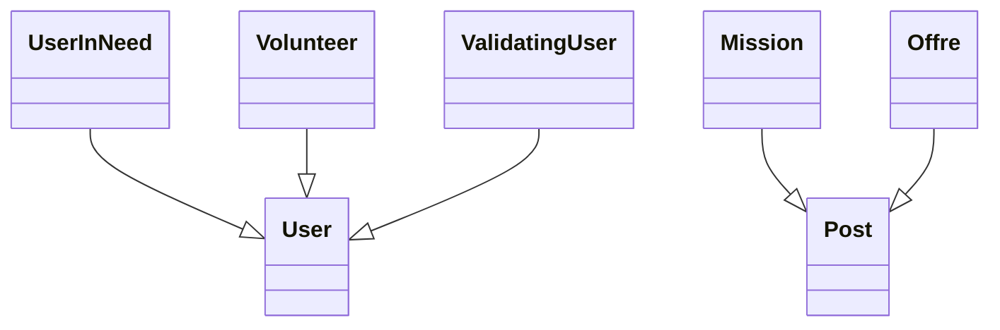

# Projet-PDLA
Mini-projet application d’aide aux personnes vulnérables en Java

```mermaid

classDiagram
    class User{
        
    }
    UserInNeed--|>User
    Volunteer--|>User
    ValidatingUser --|>User

    Post
    Mission--|>Post
    Offre--|>Post


    
```